# uci-coupon-acceptance-analysis

# The Dataset
The goal of this project was to use visualizations to distinguish customers who accepted a driving coupon versus those that didn't.

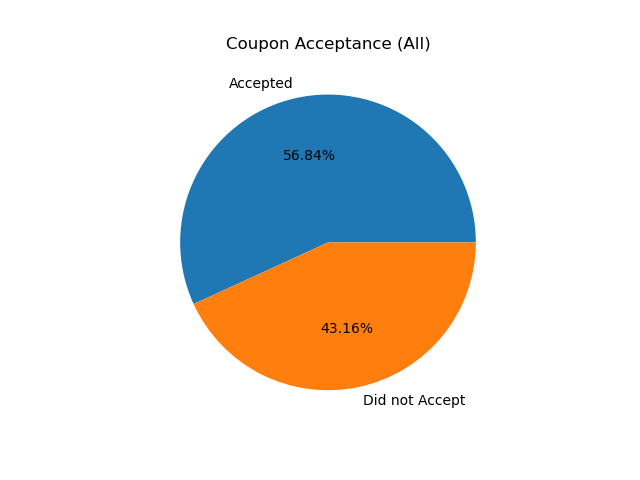

Out of all drivers in the dataset. 56.84% accepted the coupon.

# Findings

## Bar Coupons

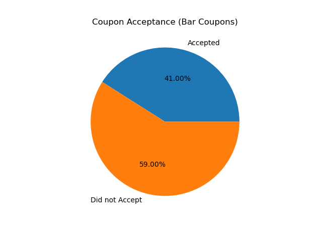

The majority of drivers didn't accept bar coupons.

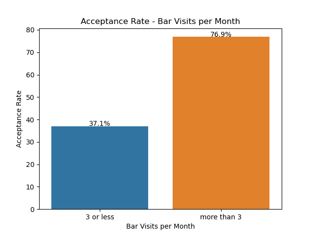 
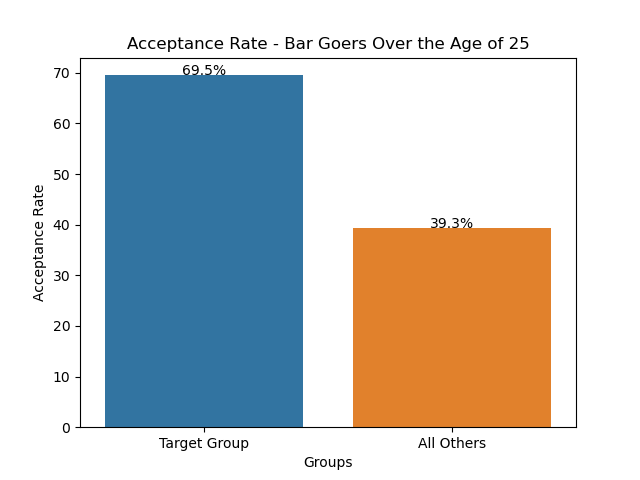

Drivers who frequent bars and drivers older than 25 are way more likely to accept the coupon.

Hypothesis: The more someone goes to a bar, the more likely it is that they will accept the coupon.

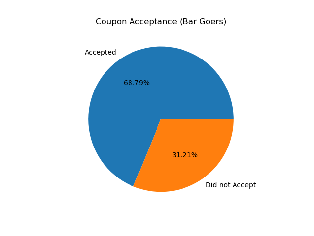

Group 1: Drivers who go to the bar more than once a month.

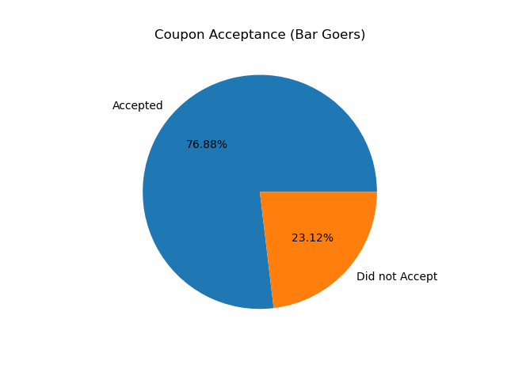

Group 2: Drivers who go to the bar more four or more times a month.

As we can see, the acceptance rate increased with the number of bar visits per month.

## Carry Out & Take Away Coupons

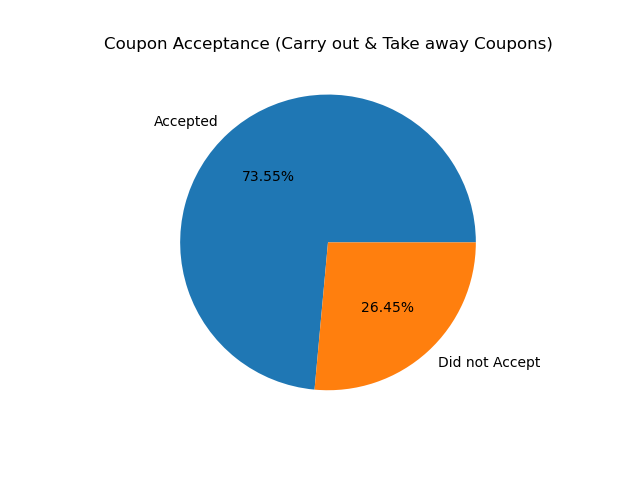

The great majority of drivers accepted carry out coupons.

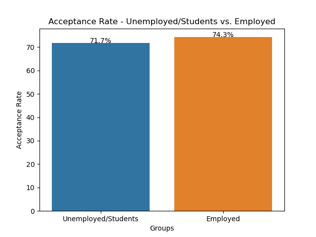
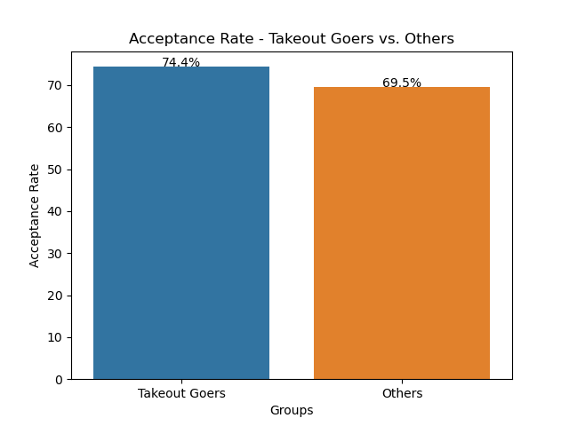
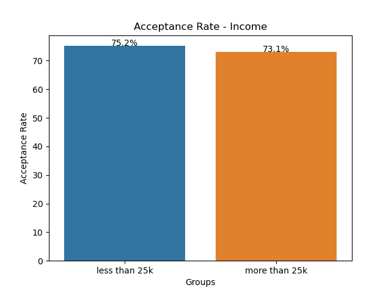

Hypothesis: As we can see from all these graphs, variables don't seem to change the acceptance rate much. This must mean that 
Carry out coupons are the most accepted ones overall.

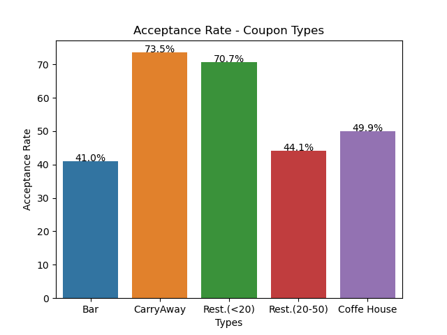

This plot shows that this is true. Cheap restaurant coupons are a close second in most accepted coupons as well.

[Full Jupyter Notebook Link](coupon_analysis.ipynb)

